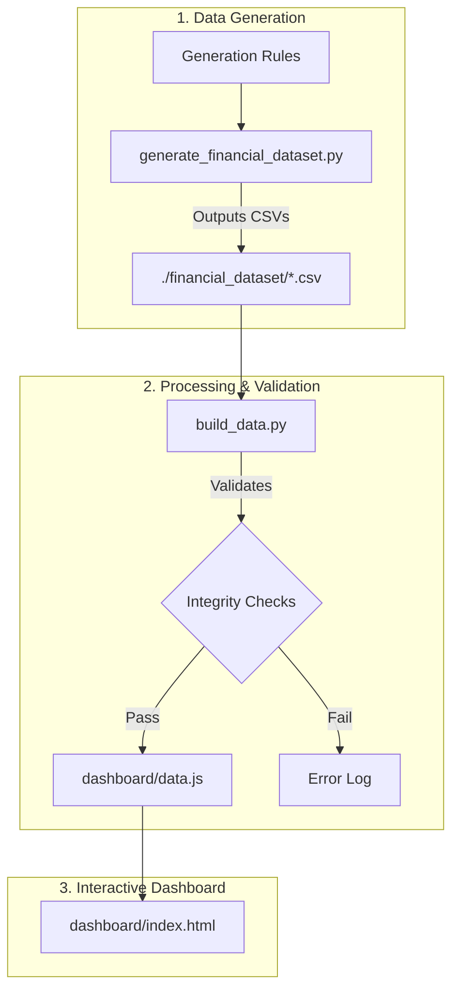
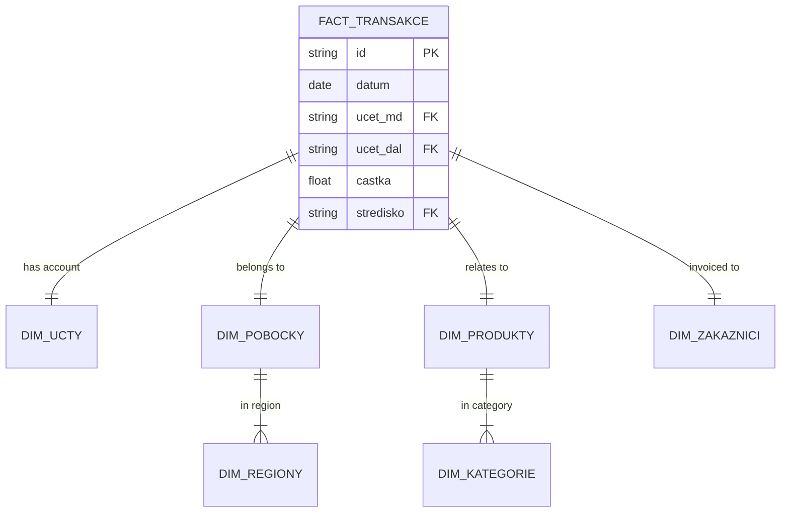

# 🏦 Financial Controlling – Data Engineering Stack

Production-grade financial data pipeline for Czech accounting data. Transforms 17 raw CSV files into analytical-ready tables with full auditability, data quality tests, automated orchestration, and interactive dashboard.

---

## 📐 Architecture



---

## 🗃️ Data Model (ER Diagram)



---

## 🚀 Quick Start

### Prerequisites
- [Docker](https://docs.docker.com/get-docker/) & Docker Compose
- Git

### 1. Clone & Start

```bash
git clone https://github.com/seidon93/Data.git
cd Data
docker-compose up -d
```

This starts:
| Service | URL / Port | Credentials |
|---|---|---|
| **PostgreSQL** | `localhost:5432` | `financial_admin` / `fin_controlling_2024` |
| **Airflow UI** | `http://localhost:8080` | `admin` / `admin` |

### 2. Run Ingestion

**Option A: Via Airflow** – Enable the `financial_data_ingestion` DAG in the Airflow UI.

**Option B: Manually**

```bash
docker exec -it airflow_webserver bash
pip install polars sqlalchemy psycopg2-binary requests
cd /opt/airflow/scripts
python ingest.py
```

### 3. Run dbt Transformations

```bash
docker exec -it airflow_webserver bash
pip install dbt-postgres
cd /opt/airflow/dbt_project

dbt deps
dbt run
dbt test
```

### 4. Generate Documentation

```bash
dbt docs generate
dbt docs serve --port 8081
```

Open `http://localhost:8081` to view the interactive lineage graph.

### 5. Open Dashboard

Open `dashboard/index.html` in your browser — no server required:

```bash
start dashboard/index.html   # Windows
open dashboard/index.html    # macOS
```

---

## 📁 Repository Structure

```
├── dashboard/                      # Interactive visualization
│   ├── index.html                  # 6-tab financial dashboard
│   └── data.js                     # Pre-computed mock data
├── dbt_project/                    # SQL transformations & tests
│   ├── models/
│   │   ├── staging/                # 17 staging models (CZ → EN columns)
│   │   ├── intermediate/           # 4 business logic models
│   │   │   ├── int_transactions_with_fx.sql
│   │   │   ├── int_costs_vs_budget.sql
│   │   │   ├── int_revenue_by_product.sql
│   │   │   └── int_cost_center_expenses.sql
│   │   └── marts/                  # 10 final analytical tables
│   │       ├── fct_transactions.sql
│   │       ├── dim_cost_centers.sql
│   │       ├── dim_accounts.sql
│   │       ├── pnl_report.sql
│   │       ├── mart_opex_budget.sql      # OPEX by category
│   │       ├── mart_capex_budget.sql     # Investments + depreciation
│   │       ├── mart_hr_budget.sql        # FTE + salary plan
│   │       ├── mart_sales_forecast.sql   # Revenue forecast
│   │       ├── mart_variance_analysis.sql # 4-way variance decomposition
│   │       └── mart_kpis.sql             # EBITDA, DSO, DPO, ROA, ROE
│   ├── tests/
│   │   └── test_double_entry_balance.sql
│   ├── dbt_project.yml
│   └── profiles.yml
├── docker/
│   └── init-db.sql                 # PostgreSQL schema init
├── orchestration/
│   └── dags/
│       └── ingest_dag.py           # Airflow DAG (daily @ 06:00)
├── scripts/
│   ├── ingest.py                   # Polars ingestion pipeline
│   └── requirements.txt
├── financial_dataset/              # 17 source CSV files
├── generate_financial_dataset.py   # Data generator script
├── docker-compose.yml              # Full stack: PostgreSQL + Airflow
├── .env                            # Configuration
└── README.md                       # This file
```

---

## 📊 Dashboard

Interactive HTML dashboard with 6 tabs — no backend required, just open `dashboard/index.html`:

| Tab | Content |
|---|---|
| **📈 KPIs** | Revenue, EBITDA, EBITDA Margin, Gross Margin, ROA, ROE, DSO, DPO, Burn Rate |
| **💰 OPEX** | Operating expenses by category (Rent, Energy, Personnel, Marketing), Plan vs Actual |
| **🏗️ CAPEX** | Capital investments, depreciation, net book value by asset type |
| **👥 HR Budget** | FTE count, salary plan, bonus ratio, employer contributions, YoY growth |
| **🛒 Sales Forecast** | Actual vs 3M rolling forecast, by product category/region/channel |
| **📊 Variance** | Volume, Price, Cost, Mix variance decomposition with detail table |

---

## 🧪 Data Quality Tests

| Test | Target | Type |
|---|---|---|
| `unique` | All primary keys (`transaction_id`, `branch_id`, etc.) | Schema |
| `not_null` | All PKs + amounts (`amount_czk`, `gross_salary_total`) | Schema |
| `accepted_values` | `currency` ∈ {CZK, EUR, USD}, `account_type` ∈ {Revenue, Expense, Asset, Liability} | Schema |
| **Double-entry balance** | Sum(debits) = Sum(credits) per fiscal period | Custom singular |

---

## 📊 Key Outputs

### Marts Layer (10 tables)

| Model | Description |
|---|---|
| `pnl_report` | P&L by period, cost center, profit center with YTD |
| `fct_transactions` | 500k enriched transactions with all dimensions, FX-normalized |
| `dim_cost_centers` | Full hierarchy: center → branch → region → country |
| `dim_accounts` | Chart of accounts with P&L line classification |
| `mart_opex_budget` | OPEX breakdown: Rent, Energy, Personnel, Marketing, Taxes |
| `mart_capex_budget` | Investments, depreciation, net book value per asset type |
| `mart_hr_budget` | FTE, salary plan, bonuses, employer costs, YoY growth |
| `mart_sales_forecast` | Actual vs forecast by product × region × channel |
| `mart_variance_analysis` | Volume, Price, Cost, Mix variance decomposition |
| `mart_kpis` | EBITDA, Gross Margin, DSO, DPO, ROA, ROE, Burn Rate |

---

## 🔄 dbt Lineage

```
17 CSV files → raw (PostgreSQL) → staging (17 views) → intermediate (4 views) → marts (10 tables)
```

Run `dbt docs generate && dbt docs serve` to view the full interactive lineage graph.

---

## 🛠️ Tech Stack

| Layer | Technology |
|---|---|
| Data Warehouse | PostgreSQL 15 |
| Orchestration | Apache Airflow 2.9 |
| Ingestion | Python 3.11 + Polars |
| Transformation | dbt-core + dbt-postgres |
| Visualization | Chart.js + Vanilla HTML/CSS/JS |
| Infrastructure | Docker Compose |
