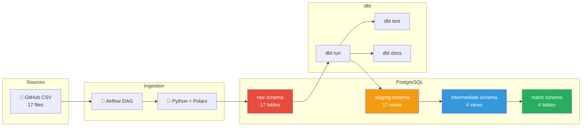
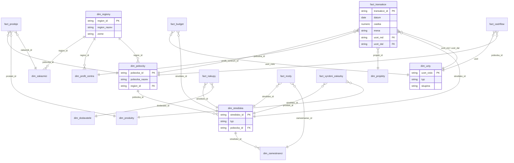

# 🏦 Financial Controlling – Data Engineering Stack

Production-grade financial data pipeline for Czech accounting data. Transforms 17 raw CSV files into analytical-ready tables with full auditability, data quality tests, and automated orchestration.

---

## 📐 Architecture



---

## 🗃️ Data Model (ER Diagram)



---

## 🚀 Quick Start

### Prerequisites
- [Docker](https://docs.docker.com/get-docker/) & Docker Compose
- Git

### 1. Clone & Start

```bash
git clone https://github.com/seidon93/Data.git
cd Data
docker-compose up -d
```

This starts:
| Service | URL / Port | Credentials |
|---|---|---|
| **PostgreSQL** | `localhost:5432` | `financial_admin` / `fin_controlling_2024` |
| **Airflow UI** | `http://localhost:8080` | `admin` / `admin` |

### 2. Run Ingestion

**Option A: Via Airflow** – Enable the `financial_data_ingestion` DAG in the Airflow UI.

**Option B: Manually**

```bash
docker exec -it airflow_webserver bash
pip install polars sqlalchemy psycopg2-binary requests
cd /opt/airflow/scripts
python ingest.py
```

### 3. Run dbt Transformations

```bash
# Enter the Airflow container (or any container with dbt installed)
docker exec -it airflow_webserver bash
pip install dbt-postgres
cd /opt/airflow/dbt_project

# Install dependencies & run
dbt deps
dbt run
dbt test
```

### 4. Generate Documentation

```bash
dbt docs generate
dbt docs serve --port 8081
```

Open `http://localhost:8081` to view the interactive lineage graph.

---

## 📁 Repository Structure

```
├── dbt_project/                    # SQL transformations & tests
│   ├── models/
│   │   ├── staging/                # 17 staging models (CZ → EN columns)
│   │   ├── intermediate/           # 4 business logic models
│   │   │   ├── int_transactions_with_fx.sql
│   │   │   ├── int_costs_vs_budget.sql
│   │   │   ├── int_revenue_by_product.sql
│   │   │   └── int_cost_center_expenses.sql
│   │   └── marts/                  # 4 final analytical tables
│   │       ├── fct_transactions.sql
│   │       ├── dim_cost_centers.sql
│   │       ├── dim_accounts.sql
│   │       └── pnl_report.sql
│   ├── tests/
│   │   └── test_double_entry_balance.sql
│   ├── dbt_project.yml
│   └── profiles.yml
├── docker/
│   └── init-db.sql                 # PostgreSQL schema init
├── orchestration/
│   └── dags/
│       └── ingest_dag.py           # Airflow DAG (daily @ 06:00)
├── scripts/
│   ├── ingest.py                   # Polars ingestion pipeline
│   └── requirements.txt
├── financial_dataset/              # 17 source CSV files
├── generate_financial_dataset.py   # Data generator script
├── docker-compose.yml              # Full stack: PostgreSQL + Airflow
├── .env                            # Configuration
└── README.md                       # This file
```

---

## 🧪 Data Quality Tests

| Test | Target | Type |
|---|---|---|
| `unique` | All primary keys (`transaction_id`, `branch_id`, etc.) | Schema |
| `not_null` | All PKs + amounts (`amount_czk`, `gross_salary_total`) | Schema |
| `accepted_values` | `currency` ∈ {CZK, EUR, USD}, `account_type` ∈ {Revenue, Expense, Asset, Liability} | Schema |
| **Double-entry balance** | Sum(debits) = Sum(credits) per fiscal period | Custom singular |

---

## 🔄 dbt Lineage

The transformation pipeline processes data through 3 layers:

```
17 CSV files → raw (PostgreSQL) → staging (17 views) → intermediate (4 views) → marts (4 tables)
```

Run `dbt docs generate && dbt docs serve` to view the full interactive lineage graph.

---

## 📊 Key Outputs

### `pnl_report` (Profit & Loss)
- Revenue vs Expenses by period, cost center, profit center
- P&L line items: Product Revenue, Service Revenue, Personnel Costs, Depreciation, etc.
- YTD running totals

### `fct_transactions`
- 500k transactions enriched with all 6 dimensions
- FX-normalized to CZK

### `dim_cost_centers`
- Full hierarchy: cost center → branch → region → country

---

## 🛠️ Tech Stack

| Layer | Technology |
|---|---|
| Data Warehouse | PostgreSQL 15 |
| Orchestration | Apache Airflow 2.9 |
| Ingestion | Python 3.11 + Polars |
| Transformation | dbt-core + dbt-postgres |
| Infrastructure | Docker Compose |
